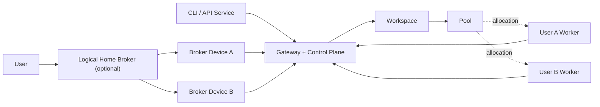

# VGen Developer and Release Guide

English | [简体中文](zh-CN/developer-guide.md)

This is the single authoritative handbook for VGen developers, contributors,
and release managers. It covers architecture, security, protocol behavior,
development, testing, versioning, builds, releases, migration, and extension
rules. Operational procedures for Gateway, Mac, and Windows installations live
in the [VGen User Guide](user-guide.md).

[`schemas/openapi-v1.json`](../schemas/openapi-v1.json) is the machine-readable
API contract. Implementation, database schema, and tests are runtime evidence.
Any public behavior change must update this guide, OpenAPI, and tests together.

## 1. Architecture and invariants

VGen separates stable user identity, local management devices, compute
resources, and the public control plane. One Gateway endpoint may host multiple
Workspaces; a CLI profile may select a default Workspace, but a Workspace is
not an endpoint.



| Principal | Authoritative relationship | Local responsibility |
|---|---|---|
| User | Owns Devices, Brokers, and Workers; may hold Workspace roles | Offline recovery words and OS-protected keys |
| Gateway | Sole metadata, admission, scheduling, lease, audit, and usage control plane | Single-process SQLite WAL |
| Logical Broker | User-owned management resource | Not a process and receives no Workspace role automatically |
| Broker Device | Acts for its User/Broker with a device certificate | Keys, re-encryption, cache, command journal, signed maintenance intent |
| Worker | Independently owned compute principal | Decrypt one task, execute, encrypt output, transfer artifacts |
| API Service | Non-human Workspace principal | Submit and read only within granted scopes |

Authorization invariants:

- Workspace Owners/Admins manage non-encrypted member state and all Pools; only
  the Owner may sign User encryption admission and issue or rotate Workspace
  Data Keys.
- Workspace roles belong to Users or Services, never Broker Devices.
- Worker ownership and Pool allocation are separate approvals.
- A Worker may enter multiple Pools, but reservations, leases, and fencing
  enforce global capacity.
- Sharing a Pool never grants one User management rights over another User's
  Worker.
- Users may own Workers without Brokers; Brokers and Workers need not share a
  machine or network.
- `manager_broker_id` delegates maintenance and does not change ownership.

The Gateway stores public keys, revocation/admission state, Workspace and Pool
metadata, encrypted references and envelopes, scheduling state, audit, and
usage. It and the ArtifactStore must never store plaintext prompts, private
parameters, input/output media, recovery words, private keys, WDKs, or TDKs.

The current architecture accepts a single Gateway/SQLite failure domain.
Federation, load-balanced writes, and active-active operation are not supported.

## 2. Identity, admission, and end-to-end encryption

### 2.1 Identity and sessions

`vgen identity init` generates 24 English BIP-39 recovery words from 256 bits
of OS randomness. HKDF with the `vgen-identity-v1` domain derives Ed25519 root
signing and X25519 recovery-encryption keys. Recovery words are never uploaded.

Each device generates Ed25519/X25519 keys and receives a root-signed device
certificate. Authentication uses a one-time challenge-response and a 15-minute
session stored only by hash. Mutations also require an RFC 9421 HTTP Message
Signature over method, raw path/query, content digest, time, and nonce. Nonces
are atomically consumed. TLS remains mandatory.

API Services have independent principals, keyrings, and sessions and may not
borrow a User Device's session or keys.

Normal control bodies are limited to 16 MiB, while public bootstrap, login,
recovery, and enrollment claims are limited to 64 KiB. Middleware counts actual
ASGI bytes as well as checking `Content-Length`. Artifact capability routes
stream against ticket `max_bytes`; media never belongs in control bodies.

Nginx and the application rate-limit by a trusted connection source. A CDN or
load balancer requires exact trusted proxy CIDRs and renewed spoofing tests.

### 2.2 Enrollment

Enrollment is a typed state machine:

```text
user | broker_device | service | workspace_member | worker_allocation
issued -> claimed -> pending | active -> expired | rejected | revoked
```

`direct_invite`, `invite_approval`, `apply_approval`, and `closed` are distinct
policies. A 256-bit invite secret is stored only by hash, defaults to one use,
and expires after 30 minutes. The complete `vgen://join/...` URI contains an
Owner-root-signed authority manifest and must be entered via a hidden prompt.

User and Workspace-member admission binds the invite, User root keys, initial
Device keys, and Device certificate in one canonical signed claim. The joining
device derives a verification code locally. The Owner receives that code over a
trusted channel, compares it, and signs `workspace-recipient-admission` before
granting a WDK. The Gateway must not supply or substitute the code.

Each client maintains a write-once Owner root pin per Workspace. Existing
pre-pin Workspaces require explicit `vgen workspace owner-migrate` legacy TOFU
confirmation. Once pinned, admission and key changes fail closed on any mismatch.

### 2.3 Workspace and task keys

Each Workspace has a versioned random Workspace Data Key (WDK), wrapped only to
Owner-admitted User recovery keys and active Devices. Every Task has a separate
Task Data Key (TDK):

1. The client sends non-sensitive scheduling requirements with `prepare`.
2. The Gateway reserves one Worker and returns its key manifest, allocation
   proof, and a short-lived artifact ticket.
3. The client verifies Worker ownership and allocation against its Owner pin.
4. The client encrypts prompt, parameters, media, and private workflow payload.
5. It HPKE-wraps the TDK to the Worker and creates a WDK reader envelope.
6. The Worker verifies Task, Attempt, allocation, lease, and fencing, executes,
   encrypts the output, and transfers it directly to artifact storage.

Small payloads use XChaCha20-Poly1305; large files use libsodium
`secretstream_xchacha20poly1305`; wrapping uses RFC 9180 HPKE with
X25519/HKDF-SHA256. AAD binds protocol, Workspace, Task, Attempt, Artifact,
recipient, and key version. Algorithms and version tags must never silently
downgrade.

When a Worker fails, the Gateway cannot rewrap the TDK. The Task becomes
`rekey_required` until an authorized CLI or Broker validates a replacement
Worker and creates a new envelope. Revoking a Device requires WDK rotation for
future tasks; revocation cannot erase old plaintext or keys already cached by a
compromised device.

### 2.4 Metadata and logging

E2EE does not hide principals, Workspace/Pool, workflow digest, Executor
requirements, state, timing, ciphertext size, addresses, or usage. Never put
sensitive filenames, prompts, or private parameters in labels, IDs, object
keys, public requirements, errors, or logs.

Logs must not contain recovery words, private keys, WDK/TDK, invite URI/secret,
session tokens, plaintext graphs/media, signed URLs, authorization headers,
environment dumps, or complete upstream responses.

## 3. API, task, usage, and error contracts

Public resources use `/api/v1`. `/healthz`, optional `/docs`, and
`/openapi.json` are operational exceptions. Clients send:

```text
Vgen-Protocol-Version: 1
Authorization: Bearer <short-lived-session>
```

Mutations also send `Content-Digest`, `Signature-Input`, and `Signature`.
Idempotency binds principal, method, path, key, and request digest. Reusing a
key with another digest returns `600002 IDEMPOTENCY_CONFLICT`. Secret-bearing
authentication, enrollment, invite, and capability responses are never cached
as idempotent results.

Every response includes `X-Request-ID`. Request models reject unknown fields;
clients may tolerate additive fields in the current API version but must reject unknown major
protocol, cryptographic, and envelope versions.

### 3.1 Tasks, Attempts, and leases

```text
prepared -> committed -> queued -> reserved -> running
                                     |          |
                                     +----> rekey_required
-> succeeded | failed | cancelled | expired
```

Each execution creates an Attempt with a TTL lease and monotonic fencing token.
Late heartbeats, completion, or uploads from an old Attempt cannot change the
new Attempt. Retrying an upload never reruns inference.

### 3.2 Usage ledger

Each Attempt keeps signed operational usage separately from its billing ledger.
The billing ledger currently stores only `output_video_duration_ms`,
`generation_elapsed_ms`, and a reserved `input_video_duration_ms` field. Input
video duration is not collected yet. The Gateway measures generation elapsed
time from the accepted start to the final report instead of trusting a Worker
metric. The future formula will use video duration, generation elapsed time, and
an approved per-second rate; until that formula is implemented, new entries have
`formula_version: 0`, zero tokens, and `billable: false`. The ledger is
append-only and corrections use reversal entries. Public units remain
`billing_token`, backed by integer microtokens.

### 3.3 Error registry

HTTP status describes transport semantics. Published six-digit business codes
are permanent and must never be reused. The registry is
[`src/vgen/protocol/errors.py`](../src/vgen/protocol/errors.py). Retry actions
form a closed set:

```text
none | same_worker | another_worker | later | rekey_required | resume_upload
```

## 4. Executor and artifact boundaries

The Gateway schedules opaque Executor requirements and never imports engine
SDKs or engine-specific graph fields. Executors implement the common prepare,
validate, execute, cancel, progress, result, and usage contract. New Executors
must pass the conformance suite.

The ComfyUI adapter renders a locally reviewed API graph and communicates only
with loopback ComfyUI. It must correlate `prompt_id`, inspect history, validate
declared outputs, and never accept arbitrary server-side file paths. Custom
nodes remain explicit pinned dependencies and are not installed by workflow
installation.

Artifacts are encrypted before leaving a client or Worker. Production uses
private OSS with short STS credentials narrowed to one object and direction.
The Gateway may validate metadata using `HEAD` but never proxies media bodies.
Local ArtifactStore support requires explicit development opt-in and must never
be a production fallback.

## 5. Workflow packages and distribution

A package is identified by publisher/name/version and an immutable digest. It
contains a manifest, parameter schema, operation mappings, reviewed Executor
payload, dependency pins, licenses, and checksum-pinned metadata. `market/` and
`custom/` namespaces are isolated; importing a custom workflow must never
overwrite a market package.

Workflow installation verifies structure, digest, signature policy, operation
mapping, and dependency declarations. It does not download model weights,
install custom-node code, or execute setup scripts. Model acquisition is an
explicit Broker maintenance job with license confirmation and revision, size,
and SHA-256 checks.

Worker wheel updates use the same signed maintenance path. The foreground
Worker entry point is a stable parent supervisor; it launches `serve` in a child
interpreter, follows only an atomic runtime pointer under the Worker's private
`runtime-releases` directory, and keeps the previous interpreter until the new
runtime completes an authenticated announce. A failed activation starts the
previous runtime with an explicit rollback marker so it can report the failed
job before clearing pending state. Neither the Gateway nor an unsigned remote
instruction may select an arbitrary executable path.

## 6. Development environment

Use Python 3.11 or later:

```bash
python3 -m venv .venv
. .venv/bin/activate
python -m pip install -e '.[gateway,broker,worker-comfyui,oss,dev]'
python -m pytest
python tools/export_openapi_v1.py --check
python tools/check_distribution.py dist
python tools/check_public_repository.py
```

Useful local services:

```bash
docker compose -f examples/docker-compose.yml \
  --env-file examples/.env.example up --build
```

Compose binds the Gateway to loopback, runs as a non-root UID, and enables a
development-only local ArtifactStore. It is not a production template.

Before establishing the first public Git baseline, inspect everything:

```bash
git status --short --ignored
git diff --check
git diff --cached --check
git ls-files
python tools/check_public_repository.py
```

Never commit virtual environments, `dist/`, local databases, credentials,
recovery material, endpoint-specific configuration, or generated private
Worker bundles.

## 7. Testing and acceptance

The default quality gate is:

```bash
python -m ruff check .
python -m pytest
python tools/export_openapi_v1.py --check
python tools/check_public_repository.py
```

Protocol and authorization changes require negative tests as well as happy
paths. Migration tests must cover old schema snapshots, interrupted migration,
foreign keys, and rollback boundaries. Installer tests must cover unsafe ZIP
paths, mismatched versions/checksums, non-interactive failure, and supported
shell or PowerShell versions.

Passing unit tests is not end-to-end acceptance. Release evidence must include:

- public HTTPS Gateway health and authenticated CLI status;
- the actual Mac LaunchAgent/Home Broker runtime version;
- a real Windows Worker heartbeat, ComfyUI version, GPU capability, and model
  verification;
- successful zero-, one-, and two-image jobs;
- downloaded outputs opened and reviewed for playback and intended semantics;
- upgrade and rollback checks for every changed component.

## 8. Versioning and release candidates

`pyproject.toml` is the only product-version source. Use full `0.MINOR.PATCH`
versions. A bug fix increments PATCH; a feature or breaking change increments
MINOR. Published versions and tags are immutable.

Release artifacts include the Python wheel/sdist, Gateway tarball, Mac ZIP, and
credential-free Windows installer ZIP. Existing files under `dist/` are not
release evidence.

### 8.1 One-command build and release flow

Configure release targets once on the release Mac:

```bash
./tools/release.sh configure \
  --gateway https://gateway.example.com \
  --releases https://downloads.example.com \
  --ssh root@ecs.example.com
```

Configuration is stored with mode `0600` under
`~/.config/vgen/release.toml`; it contains no SSH password or private key.

From a clean committed source revision:

```bash
./tools/release.sh publish --version 0.8.4
```

`publish` prepares the version commit and annotated tag when needed, runs the
quality gate, builds from one wheel, uploads immutable artifacts, and switches
the stable pointer only after verification. A formal publish requires a clean
worktree, matching `pyproject.toml`, and `vX.Y.Z` pointing at `HEAD`. Example
manual tag creation for an audited candidate:

```bash
git tag -a v0.3.1 -m "VGen 0.3.1"
```

Add `--upgrade-gateway` only when the release contains Gateway changes. Use
`--install-gateway` for a fresh Gateway; the two options are mutually exclusive.
Fresh OSS setup pauses with exit code 3 after generating deployment-specific
RAM materials. Apply them, then rerun with `--confirm-oss-configured`. Use
`--resume-gateway` for the supported partial-install boundary and
`--reset-test-gateway` only for disposable development data.

Build without uploading:

```bash
./tools/release.sh build \
  --version 0.8.4 \
  --gateway https://gateway.example.com \
  --releases https://downloads.example.com
```

Low-level builders used for independent review:

```bash
python -m build
python tools/check_distribution.py dist
python tools/build_gateway_bundle.py
./examples/macos/build-bundle.sh \
  --gateway https://gateway.example.com \
  --release-origin https://downloads.example.com
python tools/build_windows_worker_bundle.py \
  --gateway https://gateway.example.com
python tools/build_public_release.py \
  --gateway-origin https://gateway.example.com \
  --release-origin https://downloads.example.com \
  --published-at 2026-08-22T12:34:56Z
```

The Mac README and Gateway `INSTALL.txt` are generated from the User Guide.
Universal Windows packages contain no credentials. Release manifests pin size
and SHA-256 and reject extra, duplicate, escaping, symlink, or case-colliding
ZIP entries. The wheel bytes embedded in Mac and Windows packages must match.

If an old tool leaves a failed local staging directory before any `scp`, remove
only that exact version after confirming the repository root:

```bash
test "$PWD" = "$(git rev-parse --show-toplevel)" && \
  rm -rf -- "$PWD/dist/public-releases/0.3.1"
```

Never delete the entire `dist/public-releases/` directory or translate that
command into deletion of `/var/www/vgen-releases/X.Y.Z/` on ECS.

The publisher uploads an immutable version directory first, atomically replaces
the bootstrap scripts next, and switches `stable.json` last. A same-version
different-byte artifact is always rejected. On failure, retain or atomically
restore the previous stable pointer; never overwrite an immutable version.

### 8.2 Mac self-upgrade contract

`vgen upgrade` trusts only the mode-`0600` `release-source.json` written by the
installer, never the current Gateway profile. It verifies stable, manifest,
artifact size/SHA-256, ZIP safety, and internal `SHA256SUMS`. The new release is
installed in an immutable directory and activated only after `vgen --version`
and Home Broker refresh succeed; any failure restores the previous launcher.

The public first-install and repair command is:

```bash
curl -fsSL https://<release-domain>/releases/install-macos.sh | bash
```

Do not document Bash/Zsh process substitution as the standard install path.
Because stdin carries the script, interactive confirmation must read from
`/dev/tty`; headless automation must explicitly set `VGEN_INSTALL_YES=1`.

### 8.3 Manual ECS or OSS synchronization

When auditing or recovering the low-level flow:

1. Upload the complete `X.Y.Z/` to a private staging location, set directories
   to `0755` and files to `0644`, then atomically rename on the same filesystem.
2. Atomically install the bootstrap scripts.
3. Atomically install `channels/stable.json` last.
4. Fetch stable, bootstrap, manifest, and both ZIPs and verify status, cache
   headers, size, and SHA-256.

OSS/CDN follows the same immutable-version, bootstrap, then stable order and
must preserve `Content-Type` and `Cache-Control`. Release storage is independent
of the production task ArtifactStore. No credential or private Worker package
may enter the public release tree.

A formal release still needs a source commit and tag, CI and real GPU evidence,
published package SHA-256 values, signing/provenance evidence, release notes,
upgrade instructions, and a verified rollback boundary. HTTPS and checksums are
integrity controls, not publisher identity. Until notarization, Authenticode,
provenance, and real-environment review exist, describe outputs as candidates,
not signed or system-trusted packages.

## 9. Installer and reference-deployment boundaries

The Gateway bundle manages `/opt/vgen`, `/var/lib/vgen`, `/etc/vgen`, its
systemd unit, and the VGen Nginx route. It never modifies OSS, RAM roles,
security groups, or other cloud permissions. Upgrade must preflight a database
copy, create a consistent backup, and restore runtime, database, and route on a
failed health check.

The Mac bundle must not use sudo, edit shell startup files, or put secrets in a
LaunchAgent. Existing profiles are upgraded, never bootstrapped again.

The Windows installer must support PowerShell 5.1, detect common Desktop and
Portable layouts, and request explicit roots when ambiguous. It must not scan
the whole disk, guess a Documents path, write Program Files, or overwrite user
custom nodes. VGen data remains isolated under `%LOCALAPPDATA%\VGen`.

## 10. Migration from legacy shared-token deployments

The current architecture does not retain legacy `/api/*`, shared
`CLIENT_TOKEN`/`WORKER_TOKEN`, graph-in-lease, or old task history. Treat a
legacy deployment only as an offline source for custom workflows:

1. stop submissions and finish/cancel active work;
2. make a consistent database backup and record integrity checks;
3. preview `python tools/migrate_workflows_v1.py` and its `--json` plan;
4. review destinations, mappings, dependencies, and digests, then run `--apply`;
5. import only custom workflow packages, never credentials, tasks, prompts,
   media, models, or databases;
6. initialize new identities, Workspace, Pool, Workers, allocations, rates,
   and workflows;
7. complete real acceptance before switching public `/api/v1` traffic.

Rollback is service recovery, not a database downgrade. Preserve the new
deployment as a read-only incident record and never write its identities,
Tasks, envelopes, or usage back into the legacy system.

## 11. Documentation single-source rules

1. Gateway, Mac, and Windows operator procedures belong only in
   `docs/user-guide.md`.
2. Architecture, security, protocol, development, testing, versioning, builds,
   migration, and extension rules belong only in this guide.
3. The root README contains a product overview, quick start, and links to the
   two handbooks; component directories do not duplicate them.
4. Package `README.md`/`INSTALL.txt` files are generated from the User Guide.
5. Workflow READMEs are checksum-pinned package metadata.
6. OpenAPI changes require `python tools/export_openapi_v1.py`; error codes are
   added only to the central registry and published numbers are permanent.
7. Every documented command must exist in current `--help`. Never record live
   endpoints, machine paths, tokens, bootstrap codes, private keys, or one-time
   digests.
8. Release-specific commits, tags, checksums, signatures, and acceptance
   evidence belong on the Release page, not copied into these handbooks.
