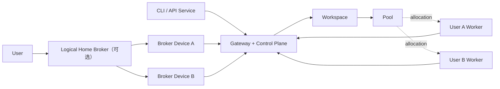

[English](../developer-guide.md) | 简体中文

# VGen 开发与发布手册

本文是 VGen 面向开发者、贡献者和发布者的唯一权威手册，覆盖架构、安全、协议、开发、
测试、版本、构建、发行、迁移与扩展约束。Gateway、Mac 和 Windows 的实际安装、升级与
日常操作统一见[《VGen 用户手册》](user-guide.md)。根目录 README 只做项目导航，不重复
维护操作命令。

机器可读的 API 契约是 [`schemas/openapi-v1.json`](../../schemas/openapi-v1.json)；实现、数据库
schema 和测试是运行事实。修改公共行为时必须同步更新本文、OpenAPI 和测试。

## 1. 架构与不变量

VGen 把稳定用户身份、本地管理设备、计算资源和公网控制面分开。一个 Gateway endpoint
可以承载多个 Workspace；CLI profile 可以绑定默认 Workspace，但 Workspace 不是 endpoint。



| 对象 | 权威关系 | 本地职责 |
|---|---|---|
| User | 拥有 Device、Broker 和 Worker；可持有 Workspace 角色 | 恢复词离线保存，根密钥和设备密钥受 OS Keychain 保护 |
| Gateway | 元数据、调度、准入、租约、审计、用量的唯一控制面 | 单进程 SQLite WAL |
| Logical Broker | User 拥有的逻辑管理资源 | 本身不是进程，也不会自动获得 Workspace 角色 |
| Broker Device | 通过设备证书代表其 User/Broker 行动 | 密钥、重加密、缓存、持久命令 journal、签名维护意图 |
| Worker | User 拥有的独立计算 principal | 解密单个任务、执行、加密结果、传输 artifact、核验维护策略 |
| API Service | 非人的 Workspace principal | 只按授予的 scopes 提交和读取 |

必须保持以下授权边界：

- Workspace Owner/Admin 管理非加密成员状态和所有 Pool；当前不另设 Pool Admin。只有
  Workspace Owner 能签发 User 的加密准入、发放或轮换 WDK，普通 Admin 不能代替 Owner
  改变密钥接收者集合。
- Workspace 角色属于 User 或 Service，不属于 Broker Device。
- Worker 所有权与 Pool allocation 是两种关系；Worker Owner 同意提供资源，Workspace
  Owner/Admin 同意接纳资源，二者缺一不可。
- Worker 可进入多个 Pool，但容量是全局的，由 reservation、lease 和 fencing token 防止重复
  消费。
- B 的任务可以在同一 Pool 中运行于 A 的 Worker，但 B 不因此获得 A Worker 的管理权。
- User 可以只有 Worker、没有 Broker；Broker 与 Worker 也不需要在同一台机器。
- `manager_broker_id` 是可空的维护委托，不改变 Worker 所有权。

Broker Device heartbeat 上报产品运行版本、协议版本、可选构建 commit、journal backlog 和心跳
时间；Gateway 将这些非敏感运维字段保存在 `broker_devices` 并由 `GET /api/v1/brokers` 返回。
新增字段保持可空，使旧 Broker 在 Gateway 滚动升级期间仍能 heartbeat。`vgen broker status`
展示 Gateway 观测值并标记旧版本，`vgen broker local-status` 则只读检查本机受管 LaunchAgent；
Mac 安装器通过 `vgen broker service-refresh` 原地重载已有 Broker，不创建新 Device 或身份。

Gateway 保存公钥、撤销状态、Workspace/Pool/allocation、任务状态、Worker 能力、密文引用、
KeyEnvelope、审计和用量账本。Gateway 和 ArtifactStore 不得保存明文 prompt、私有参数、
输入/输出媒体、恢复词、私钥、Workspace Data Key 或 Task Data Key。

当前架构接受单 Gateway/SQLite 单点：Gateway 不可用时不能创建准入、提交新任务或领取新 lease；
Worker 可以完成已开始的本地执行并 journal 结果等待重试。跨 Gateway 联邦、负载均衡写入和
当前不支持 active-active。

## 2. 身份、准入与端到端加密

### 2.1 身份与会话

`vgen identity init` 从 256 位机器随机熵生成带校验的 24 个 BIP-39 英文恢复词。恢复词不能由
用户自行编造，也不能上传 Gateway。根种子通过带 `vgen-identity-v1` 域分离的 HKDF 派生
Ed25519 User 根签名密钥和 X25519 User 恢复加密密钥。

每台设备随机生成自己的 Ed25519/X25519 密钥，由 User 根签名设备证书。日常请求只使用设备
密钥；`user_id` 是 Gateway 分配的稳定随机 ID，因此设备迁移和密钥轮换不会改变所有权记录。

认证流程为一次性 challenge-response。Gateway 返回 15 分钟短 session，只保存 session hash、
expiry、scopes 和撤销状态。每个变更请求还必须携带受约束的 RFC 9421 HTTP Message Signature，
覆盖 method、原始 path/query、content digest、时间和 nonce。Gateway 原子消费 nonce 防重放。
TLS 仍是强制要求，签名不提供传输保密。

Service 使用独立 Ed25519/X25519 principal、独立 keyring namespace 和独立 session；不得借用
同机 User Device 的 session 或根密钥。

Gateway 的应用层控制请求默认最多 16 MiB；这个上限覆盖 4096 个加密 KeyEnvelope 的批量轮换，
但不承载媒体。公开的 Bootstrap、challenge/session、设备恢复和 enrollment/Invite claim 最多
64 KiB。中间件先检查 `Content-Length`，再按 ASGI 实际 chunk 累加，不能相信声明长度；artifact
capability 路由不聚合正文，而是在验证 ticket 后按其 `max_bytes` 流式处理。参考 Nginx 配置采用
同样的 16 MiB/64 KiB 边界，只在 artifact 路由关闭 request buffering。进程内 token bucket
作为 Nginx 之外的兜底，按来源与端点类别返回带 `Retry-After` 的 429；bucket 使用有上限的 LRU/
空闲淘汰，不把攻击者来源写入 SQLite。`VGEN_GATEWAY_MAX_CONTROL_BODY_BYTES` 只用于受控的嵌入式
部署；修改它时必须同步审核 Nginx 和最大合法 schema，不能借此接收媒体。

参考 Nginx 默认直接面对客户端，以 `$binary_remote_addr` 建桶，并把传给 loopback Uvicorn 的
`X-Forwarded-For` 强制覆盖为 `$remote_addr`，绝不能接纳公网请求自带的 forwarding chain。引入
CDN/LB 前，必须按供应商公布的精确出口 CIDR 配置 `set_real_ip_from` 和对应 `real_ip_header`，验证
伪造头无法改变来源后再切流；否则要么所有用户共享代理 IP 被误限，要么攻击者可伪造 IP 绕限。

周期 sweep 除调度状态外，还删除过期 challenge、request nonce、idempotency record、无活动维护
lease 引用的过期 session，以及超过 ticket 最大有效期保护窗口的 transfer-ticket use。已撤销但尚未
到期的 session 行保留到原 expiry，便于短期诊断且令旧测试/审计语义稳定；它们仍无法通过认证。
清 session 前必须先清理 terminal maintenance job 的外键；active lease 的 session 行必须保留到
fencing/关闭完成。新增临时安全表时必须同时提供 expiry 索引和 sweep 规则。

### 2.2 Enrollment

Enrollment 是统一状态机，不是可互换的凭据：

```text
user | broker_device | service | workspace_member | worker_allocation
issued -> claimed -> pending | active -> expired | rejected | revoked
```

| 策略 | 流程 |
|---|---|
| `direct_invite` | 预授权，完成对应主体的密钥证明后直接激活 |
| `invite_approval` | claim 后 pending，由管理员再次批准 |
| `apply_approval` | 无 invite，申请后 pending，由管理员批准 |
| `closed` | 拒绝新的邀请或申请 |

Invite 的 `invite_id` 只是公开定位符；256 位 secret 只以 hash 保存，默认一次使用、30 分钟
过期。CLI 生成的完整 `vgen://join/...` URI 还包含由签发方 User 根签名的 authority manifest。
接收方必须通过 stdin/隐藏输入使用完整 URI，不能只信任 Gateway 返回的签发公钥。

User 和 `workspace_member` claim 必须是一个固定 canonical object，同时绑定 Invite、User 根
签名/恢复加密公钥、初始 Device 签名/加密公钥和根签发的 Device certificate，并由该 Device
签名。加入方从完整 claim 本地计算 80-bit 核验码，通过可信对话交给 Workspace Owner；Owner
端不得从 Gateway 接收或自动接受这个码。Owner 比对后签署不可变的
`workspace-recipient-admission`，把 Workspace、Owner 根、subject User、Enrollment、完整 claim
及其 digest 绑定起来。

每台客户端还维护每个 Workspace 唯一、write-once 的 Owner root pin。新 Workspace 在创建端
落 pin；加入端只从签名 Invite fragment 落 pin。User invite、审批、WDK grant 和 rotation
必须同时满足 Gateway 的 Owner 授权与本地 Owner pin，不能仅相信 Gateway 声称的角色。由
0.2.2 升级且尚无 pin/signed genesis 的既有 Owner 只有一次 legacy TOFU bootstrap：普通 WDK
mutation 默认 fail closed，操作者必须显式运行 `vgen workspace owner-migrate`，核对屏幕上的
Gateway、Workspace、User 和 root key ID，再输入固定确认词。本地身份还必须与 Gateway 当前
记录的 Workspace Owner User 一致；落 pin 后永久按严格路径校验。非交互环境只有显式危险选项
`--accept-legacy-tofu` 才能跳过输入。这个历史兼容边界不得扩展给已有 Owner pin 的 Workspace。

Pool-bound Worker 不走通用 Invite：先创建 User-owned Worker，再建立 owner offer 和 Workspace
approval。User、Broker Device、Service 和 Workspace member 分别使用自己的 key-proof 路由，
一种 Invite 不能被解释为另一种 principal。

### 2.3 Workspace 与 Task 密钥

每个 Workspace 使用版本化的随机 Workspace Data Key（WDK），分别封装给已由 Owner 签名准入
的 User recovery key 和该 User 的 active Device。0.3.0 对新的 Service WDK grant 明确
fail closed；只有在 Service 具备等价的 Owner 签名 key-proof 后才能重新开放。每个 Task 再
生成独立 Task Data Key（TDK）：

1. 客户端向 Gateway `prepare` 提交非敏感调度要求。
2. Gateway 预留一个具体 Worker，返回 Worker key manifest、allocation proof 和短期 artifact
   ticket。
3. 客户端用本地 pin 验证 Worker Owner 证书和 Workspace Admin 签名的 allocation proof。
4. 客户端用 TDK 加密 prompt、参数、输入和私有 workflow payload。
5. 客户端用 HPKE 把 TDK 封装给 Worker，并用 WDK 创建 reader envelope。
6. Worker 验证 task、attempt、allocation、lease 和 fencing token 后解密执行；输出在上传前加密。

小消息使用 XChaCha20-Poly1305，大文件使用 libsodium
`secretstream_xchacha20poly1305`，key wrapping 使用 RFC 9180 HPKE
X25519/HKDF-SHA256。AAD 必须绑定协议版本、Workspace、Task、Attempt、Artifact、recipient 和
key version；不得自创算法、重复 nonce/key pair 或静默降级算法标识。

WDK recipient 响应必须携带并由客户端复核 admission digest、recipient key digest、Device
certificate digest 和整体 binding digest；envelope AAD 与 Owner 签名 manifest 同时绑定这些
digest。rotation 是整个 recipient snapshot 的原子签名操作，每个 recipient 都要先通过本地
Owner pin 和 admission 链验证。允许历史 envelope 只读解密，但不得用裸 Gateway 公钥创建
新的 grant。

该设计阻止恶意 Gateway 引入从未被 Owner 接纳的密钥，但 0.3.0 尚无签名透明日志或单调
membership epoch：Gateway 仍可能向某个离线客户端重放一套过去确由 Owner 签过的旧 recipient
集合。此残余风险必须写入威胁模型；后续用 Owner 签名 epoch/append-only transparency proof
收口，不能把 Gateway 数据库时间戳当作可信顺序。当前签名 Invite fragment 绑定 Invite ID、
secret hash、Workspace、issuer 和 Owner root，但尚未把 role/scopes/method/expiry 全部纳入签名
语义；这些字段在下一协议版也应进入 canonical Owner-signed manifest。

Worker 失效时 Gateway 不能自行重封装 TDK。任务进入 `rekey_required`，由在线的获授权 CLI
或 Broker 从 reader envelope 恢复 TDK，验证替代 Worker 后重新封装。Broker journal 只保存
Task/Workspace/key version/failed Attempt 等元数据，不保存 WDK、TDK、reader envelope、prompt
或 artifact ticket。

撤销丢失 Device 后必须轮换 WDK，保护轮换后的新任务。撤销不能抹除已被受损设备缓存的旧
密钥或明文；历史 envelope 为读取旧任务而保留。

### 2.4 可见元数据与日志边界

E2EE 不隐藏 principal、Workspace/Pool、workflow digest、Executor requirement、状态、时序、
密文大小、网络地址和用量。不要把 prompt、敏感文件名或私有参数放入公开 label、requirements、
ID、object key、错误 details 或日志。

日志和错误不得包含恢复词、私钥、WDK/TDK、Invite URI/secret、session、明文 graph/media、
签名 URL/ticket、认证 header、环境变量 dump 或完整上游响应。详细漏洞报告入口见
[`SECURITY.md`](../../SECURITY.md)。

## 3. API、任务、用量与错误契约

所有公共资源位于 `/api/v1`。`/healthz`、可选的 `/docs` 和 `/openapi.json` 是运维例外；不保留
旧 `/api/*` 兼容路由。客户端发送：

```text
Vgen-Protocol-Version: 1
Authorization: Bearer <short-lived-session>
```

变更请求还发送 `Content-Digest`、`Signature-Input` 和 `Signature`。普通控制面和任务 mutation
支持 `Idempotency-Key`；相同 principal/method/path/key 和相同请求摘要返回原结果，不同摘要
返回 `600002 IDEMPOTENCY_CONFLICT`。认证、secret-bearing enrollment、Invite 和 artifact
capability 路由不得把敏感响应写入幂等缓存。

Gateway 为每个响应提供 `X-Request-ID`。客户端只记录 request ID、资源 ID 和稳定错误码，不能
记录敏感请求体。Pydantic 请求模型拒绝未知字段；客户端可容忍当前 API 版本增加响应字段，但必须拒绝
未知协议主版本、密码算法或 envelope 版本。

### 3.1 Task、Attempt 与 lease

```text
prepared -> committed -> queued -> reserved -> running
                                     |          |
                                     +----> rekey_required
-> succeeded | failed | cancelled | expired

reserved -> leased -> running -> succeeded | failed | cancelled | expired
```

每次执行都创建独立 Attempt。lease 带 TTL、Attempt ID 和单调递增 fencing token；旧 heartbeat、
finish 或上传完成不得改变新 Attempt。上传失败只恢复同一密文上传，不得再次调用推理。

### 3.2 用量账本

每个 Attempt 的签名运行数据与计费账本分开保存。计费账本当前只记录
`output_video_duration_ms`、`generation_elapsed_ms`，并为尚未支持的输入视频预留
`input_video_duration_ms`。生成耗时由 Gateway 根据已确认的开始时间和最终报告时间测量，
不采用 Worker 自报值。后续公式将使用视频时长、生成耗时和已审批的每秒费率；公式落地前，
新账本固定为 `formula_version: 0`、金额为 0、`billable: false`，不按 GPU 或流量计算费用。
账本只追加；纠错写 reversal entry，不修改历史行。公开单位名仍为 `billing_token`，内部使用
整数 microtoken，避免与 tokenizer token 混淆。

### 3.3 错误注册表

HTTP status 表达传输语义，六位业务码是永久机器契约，不得复用。权威注册表位于
[`src/vgen/protocol/errors.py`](../../src/vgen/protocol/errors.py)。范围如下：

| 范围 | 类别 |
|---|---|
| `10xxxx` / `11xxxx` / `12xxxx` | 认证、设备、权限 |
| `20xxxx` / `21xxxx` / `22xxxx` / `23xxxx` / `24xxxx` | Workspace、Broker、Worker、Pool、Enrollment |
| `30xxxx` / `31xxxx` | Task、Attempt、lease、rekey |
| `32xxxx` / `33xxxx` / `34xxxx` | Workflow/Executor、Artifact、Worker maintenance |
| `40xxxx` / `50xxxx` / `60xxxx` / `70xxxx` / `90xxxx` | Crypto、Usage、Protocol、Dependency、Internal |

Retry action 是闭集：

```text
none | same_worker | another_worker | later | rekey_required | resume_upload
```

CLI exit code 固定为：`0` 成功，`2` 参数/校验，`3` 身份/权限，`4` 不存在/状态冲突，`5` 可重试
不可用，`6` Worker/Executor，`7` 加密/完整性，`8` 用量/rate/quota，`1` 未分类内部错误。

## 4. Executor 与 Artifact 边界

Worker Core 负责 Gateway 会话/签名、lease fencing、加密输入/输出、artifact 传输、进度、取消、
journal 和 usage。Executor 只负责一个本地推理 runtime，Gateway 与 ArtifactStore 不得引入
ComfyUI 类型。

```python
class Executor(Protocol):
    def descriptor(self) -> ExecutorDescriptor: ...
    def health(self) -> ExecutorHealth: ...
    def capabilities(self) -> Mapping[str, Any]: ...
    def execute(self, request: ExecutionRequest, context: ExecutionContext) -> ExecutionResult: ...
    def cancel(self, handle: str | None = None) -> None: ...
```

`ExecutionRequest` 只包含 Task/Attempt、workflow digest、operation、payload format、opaque payload、
本地输入和 deadline；不得包含 Gateway session、Pool policy、云凭据或 artifact ticket。
`ExecutionResult` 返回通用本地 artifact、原始 usage、Executor run ID 和安全媒体元数据。

一个 Worker ID 只启用一个 Executor 实例；多 GPU 主机可以运行多个独立 Worker 进程。
协议使用 `executors[]` 为未来多 Executor Worker 预留。插件通过 `vgen.executors` Python entry
point 注册；发现 descriptor 不等于允许安装，Executor/custom node 都是需要机器管理员审核的
可执行代码。

内置 ComfyUI adapter 使用 `comfyui-api-graph/v1`：

1. `/system_stats` 健康检查，`/models` 或 `/object_info` 发现能力；
2. 解密 graph 先经过机器管理员拥有的本地执行策略；
3. 声明的图片经 `/upload/image` 上传，只重写映射到的 `LoadImage` 字段；
4. `/prompt` 提交，WebSocket 跟踪，断线后 history polling；
5. `/interrupt` 取消，history 解析通用输出；
6. Worker Core 加密并上传结果，ComfyUI 永远不接触 Gateway/OSS 凭据。

执行策略必须是非 symlink、受权限保护的 YAML/JSON，固定 workflow digest、node allowlist、资源
上限以及模型的相对路径、size、SHA-256、source/revision/license。未绑定的 `LoadImage`、路径逃逸、
未知 node 或超限 graph 在联系 runtime 前失败。参考策略是
[`examples/comfyui-minimax-h3-policy.yaml`](../../examples/comfyui-minimax-h3-policy.yaml)。

Artifact adapter 接收通用短期 ticket。OSS ticket 带仅对一个对象、一个方向有效的 STS
AccessKeyId/AccessKeySecret/SecurityToken，敏感字段禁止进入 repr、日志和幂等记录。CLI/Worker 通过
OSS SDK 直传直下，大文件使用 multipart/resumable；Gateway 只执行 AssumeRole 和 HEAD，不代理
媒体正文。生产 Gateway 强制任务 Artifact 使用 OSS，本地 adapter 只允许自动化测试显式注入。
下载在解密前校验密文 size/digest；上传 journal 可刷新 STS ticket 后续传同一密文而不重复推理。

SGLang Diffusion 未来应作为本地 service adapter，Diffusers 应在隔离子进程加载 Pipeline。
新增 adapter 不得把 engine 字段加入 Gateway Task、lease、ArtifactStore 或 usage 协议。

## 5. 工作流包与市场

每个 release 由不可变的 `namespace/name@semver + sha256 package digest` 标识。市场包和 custom
包使用不同 provenance/目录；更新市场包永不覆盖 custom 包。

```text
manifest.yaml
README.md
workflow.json
mapping.json
checksums.sha256
artifact.sig       # signed market package
```

Package manifest 描述公共参数 schema、Executor variant、payload format、operation、资源要求、
模型/custom node 依赖、许可证和发布者。Gateway 只按公开 requirement 和 digest 调度，不解析
私有 graph。

市场安装必须先校验安全相对路径、entry 数量、解压大小、checksums、package digest 和发布者签名。
首次远程安装还必须从独立渠道 pin publisher key。未签名包只能显式 `--allow-unsigned` 安装，
并保持 unsigned provenance。模型和可执行节点始终是独立 artifact 与维护任务；受管 custom
node 必须固定 Node Pack ref、归档摘要、源码 commit、class 清单和离线 wheel，Worker 不执行
包内任意安装脚本。

Broker 的 `workflow-install` 把普通 release ZIP 的文件 SHA-256/size、workflow ref/digest、
publisher pin（或明确 unsigned 授权）以及审核过的 node-class digest 一并写入 Device 签名的
maintenance intent。Worker 在私有 staging 中重新验证这些绑定，只允许 inert workflow 数据，
编译 ComfyUI policy 后再原子更新 active index。同 digest 的已激活 release 如被损坏，远程重装
会先隔离旧目录，再用重新验证的 staging 副本替换；不同签名 intent 的 capability/model 任务
不会共用同一个维护任务或授权来源，因此一个调用失败时不能取消或回滚另一个调用。同一 intent
的重试仍保持幂等。创建响应通过 `creation_disposition` 和 `intent_owns_job` 明确所有权，CLI 只在
后者为 true 时把任务 ID 用于自动回滚。Worker 更新不产生工作流/模型授权，仍可按不可变包摘要
安全去重。
验证期间其他工作流保持可用。执行时 Worker
会用包内 mapping 和校验后的
有效参数重建 graph，并要求 operation、拓扑、输入绑定及模型 loader 路径精确一致。一个 release
验证失败不会移除旧 H3 policy 或其他已激活工作流。对受管 Node Pack，Worker 在隔离目录安装
私有依赖，仅暂停 ComfyUI 而保持远程通道在线，原子激活后通过 `/object_info` 验证；失败自动
回滚。激活回执覆盖每一个文件并在 heartbeat 时重新校验。历史手工 custom node 仍属于单独的
机器管理员边界。

模型在 manifest 中记录 source、immutable revision、SHA-256、size、`gated`、
`manual_download`，并可保留 license 作为只读发布元数据。VGen 不收集或验证用户的许可证
接受记录。Broker 发起 `model-install` 时，Worker 仍以机器管理员本地 policy 为最终授权；
remote spec 不能覆盖 source 或目标路径。`manual_download` model 不得自动下载；gated model
只读取 Worker 本机 `HF_TOKEN`/`HF_TOKEN_PATH`，credential 不进入 Gateway spec。
权重按 digest 存入共享 CAS，再用只读硬链接 materialize 到每个工作流 placement；同 digest
只下载一次，但 readiness 仍逐工作流、逐 placement 验证。每次复用前重新核对 size/SHA-256，
不允许一个被改写的共享 inode 静默扩散到新 placement。

新版 ComfyUI heartbeat 使用 `capability_schema_version: 2` 和 `workflow_readiness` 报告精确
ref/digest/state。Gateway 对 v2 Worker 只调度唯一且 `ready` 的精确 release；畸形、重复或未知
schema fail closed。manifest 的显存和内存下限分别产生 `insufficient_vram`、`insufficient_ram`；
在 Worker facts 可用时，Broker 会在模型传输前检查，Worker 执行前还会再次强制检查。未升级
Worker 保留旧 requirement fallback，且它们不会领取
`capability_install` maintenance job。

滚动升级时，新 Worker 会先协商自己支持的 maintenance actions；若 0.9.x Gateway 因不认识该
字段而拒绝，Worker 会退回更窄的旧 claim，并定期重新探测。因此在 Gateway 完成升级前，原有
推理轮询不会被中断。

Worker wheel 更新复用同一条签名 maintenance 链路。任务计划程序宿主先启动稳定的运行时监督进程，
`serve` 运行在子解释器中；运行时监督进程只接受 Worker 私有 `runtime-releases` 目录下的原子运行时
指针。新 runtime 完成 Gateway 认证上线后才清除待激活状态；激活失败时，监督进程用明确的
rollback 标记启动上一 runtime，由旧 runtime 先向 Gateway 回报失败，再清理本地 pending 状态。
Gateway 和未签名的远程指令都不能指定任意可执行文件路径。

`comfyui-api-graph/v1` mapping 把通用参数映射到 node title/input。优先使用唯一 `_meta.title`，
未知参数、缺失/歧义 node、连接覆盖或类型不匹配都在 prepare 前失败。MiniMax 参考包的图片语义：

| 图片数 | Operation | Graph 行为 |
|---:|---|---|
| 0 | `t2v` | 删除首尾 `LoadImage` node 与连接 |
| 1 | `i2v` | 保留首帧，删除尾帧 node/连接 |
| 2 | `flf` | 分别绑定首帧与尾帧 |

仅把图片字段设为空不能移除 ComfyUI 导出的默认图；删除连接必须由 mapping 中精确的
`optional_connection` 元数据证明。参考包位于
[`workflows/vgen/minimax-h3-8step/1.0.0`](../../workflows/vgen/minimax-h3-8step/1.0.0)。
原生 LTX-2.5 T2V 参考包位于
[`workflows/vgen/ltx-2.5-distilled-t2v/1.0.0`](../../workflows/vgen/ltx-2.5-distilled-t2v/1.0.0)。

已发布工作流目录按内容摘要视为不可变。H3 `1.0.0` manifest 中的
`github.com/vgen-project/vgen` 是保留的历史计划地址，当前源码和支持仓库是
`github.com/deofly/vgen`。修正该 provenance 必须发布新的工作流版本并同步更新 bootstrap
授权摘要，不能改写 `1.0.0`。LTX GGUF `1.0.0` 至 `1.0.3` README 中的自动 bootstrap
描述同样属于历史包字节。`1.0.4` 改为声明受管的
`vgen/comfyui-gguf@1.0.1` Node Pack，可由独立 Marketplace 发布和远程安装，不依赖 VGen
源码版本发布。

## 6. 开发环境

要求 Python 3.11+：

```bash
python3 -m venv .venv
. .venv/bin/activate
python -m pip install --upgrade pip
python -m pip install -e '.[gateway,broker,worker-comfyui,oss,dev]'
```

确认入口和唯一产品版本：

```bash
python tools/project_version.py
vgen --version
vgen-gateway --help
vgen-broker --help
vgen-worker --help
```

本地 Gateway 冒烟：

```bash
mkdir -p .local/vgen-dev
vgen-gateway --database "$PWD/.local/vgen-dev/gateway.db" init
VGEN_ARTIFACT_STORE=local VGEN_ALLOW_LOCAL_ARTIFACT_STORE=1 \
  vgen-gateway --database "$PWD/.local/vgen-dev/gateway.db" serve \
  --host 127.0.0.1 --port 8000
```

这里的两个环境变量只允许本机开发和自动化测试显式启用本地密文 ArtifactStore。也可以在
`examples/` 目录复制 `.env.example` 后执行 `docker compose up --build`；该 Compose 配置只把
Gateway 发布到宿主机 loopback，不包含公网 TLS 代理。任何公网、共享或生产部署都必须使用
第 8 节的 OSS 配置，不能设置 `VGEN_ALLOW_LOCAL_ARTIFACT_STORE=1`。

另一个终端：

```bash
curl --fail http://127.0.0.1:8000/healthz
vgen identity init
vgen profile add local http://127.0.0.1:8000
IFS= read -r VGEN_LOCAL_BOOTSTRAP < .local/vgen-dev/bootstrap-code
printf '%s\n' "$VGEN_LOCAL_BOOTSTRAP" | \
  vgen gateway bootstrap --display-name 'Local Operator'
unset VGEN_LOCAL_BOOTSTRAP
rm .local/vgen-dev/bootstrap-code
```

公开 `/healthz` 只返回 `{"ok":true}`。需登录的 `/api/v1/status` 中，Worker 数量使用
`workers_total`、`workers_active`、`workers_online` 和
`workers_revoked` 四个明确字段。`workers_online` 与调度器共享同一规则：状态为 active，且
最近 120 秒内存在心跳；不要把 `workers_active` 当作实时在线数。

Bootstrap code 只能经 stdin 进入 CLI，不得进入命令参数、日志、Issue、聊天或截图。

### 6.1 首次建立 Git 基线

发行工具只接受可定位的 Git 提交，不能从一整个未跟踪目录或混有本地运行数据的工作区构建。
首次接管尚未提交的源码时，先检查忽略规则和待提交范围：

```bash
git status --short --ignored
git check-ignore -v -- dist/ .venv/ './:memory:' .DS_Store
```

`.gitignore` 必须至少排除虚拟环境、`dist/`、运行数据库、密钥、构建缓存、系统文件和根目录
测试数据库 `:memory:`。如果 `git check-ignore` 没有为这些路径显示规则，先修复忽略规则，不能
通过手工删除来源不明的文件来掩盖问题。随后检查未忽略文件中不存在恢复词、私钥、Invite、
Bootstrap code、session、Worker credential、`.env` 或真实 artifact URL，再建立并审核基线：

```bash
git add -- .
git status --short
git diff --cached --check
git diff --cached --stat
git commit -m 'chore: establish reviewed VGen source baseline'
```

`git add -- .` 只能在前两项检查和 secret 审查完成后执行。首次提交后，每个功能或修复使用独立
提交；发布前 `git status --porcelain=v1 --untracked-files=all` 必须没有输出。统一 `publish` 命令
会更新 `pyproject.toml`、创建独立版本提交并建立指向该提交的 `vX.Y.Z` tag，不要求发布人员手工
同步这些状态。不要把 `dist/` 产物、Release 页面材料或 ECS 下载目录加入源码提交。

首次为已审核提交创建发行标签时使用 annotated tag，并确认它确实指向当前 `HEAD`：

```bash
git tag -a v0.3.1 -m 'VGen 0.3.1'
git show --no-patch v0.3.1
test "$(git rev-parse HEAD)" = "$(git rev-list -n 1 v0.3.1)"
```

尚未公开发布的本地标签可以在修复发布阻塞后重新创建；已经推送或被 stable 引用的标签禁止移动，
必须发布新版本。

仅当标签从未推送、对应版本也从未被 stable 引用时，可以把它重新指向修复后的当前提交：

```bash
git tag -d v0.3.1
git tag -a v0.3.1 -m 'VGen 0.3.1'
test "$(git rev-parse HEAD)" = "$(git rev-list -n 1 v0.3.1)"
```

## 7. 测试与验收

每次变更先确认工作区只包含本次范围，再运行完整质量门：

```bash
python -m pytest
ruff check src tests tools
bandit -c pyproject.toml -r src tools
python -m pip_audit . --progress-spinner off
python tools/export_openapi_v1.py --check
python tools/check_public_repository.py
python -m build
python tools/check_distribution.py dist
```

修改 SDK 时还必须通过线上协议兼容向量和两个独立语言包的测试：

```bash
python -m pip install -e 'sdks/python[dev]'
python -m pytest tests/sdk_compat sdks/python/tests
mvn --file sdks/java/pom.xml test
```

两个 SDK 共用 [`tests/sdk_compat/vectors.json`](../../tests/sdk_compat/vectors.json)。SDK 只能
增量增加客户端能力，不得导入 CLI 内部模块，也不得要求改变已部署 CLI、Gateway、Broker 或
Worker 的线上格式。

`check_public_repository.py` 同时检查已跟踪和未忽略的新文件，拒绝本机状态、凭据文件、私钥头、
常见云 AccessKey 形式和超过 10 MiB 的源码文件。它不能替代托管平台的私密漏洞报告或发布前对
完整 Git 历史的 secret 扫描，但会阻止最常见的误提交进入 Pull Request。

测试分层：

| 层级 | 目标 | 证据 |
|---|---|---|
| L0 static | schema/import/error registry | 静态契约和发行内容 |
| L1 fake Executor | Worker Core | lease、progress、cancel、artifact、usage、retry |
| L2 mocked adapter | runtime 映射 | 精确请求和安全错误翻译 |
| L3 real runtime | 本地 ComfyUI/未来 adapter | health、capability、execute、cancel、output |
| L4 full E2E | Gateway + 密文存储 + real Worker | enroll、prepare/commit、lease、decrypt、execute、upload、billing |
| L5 product | 真实 workflow/material | 人工质量检查 |

Executor 变更至少覆盖输入隔离、进度、取消、timeout、OOM、缺依赖、lease loss、stale fencing、
上传恢复和每 Attempt 用量。维护变更至少覆盖签名/manager 篡改、受限凭据、私网/重定向 source、
断点续传、磁盘不足、路径冲突、digest mismatch、更新降级、激活失败回滚和 late completion。

MiniMax H3 必须在真实 GPU 分别执行 0/1/2 图，检查实际 `/upload/image`、`/prompt`、WebSocket/
history、取消、加密结果上传和视频质量。仅有 `worker doctor`、单元测试或可播放文件都不等于
产品验收。

完整 E2E 还要注入 Gateway、Broker、Worker、Executor、ArtifactStore 不可用，验证不同错误码；
测试 reservation expiry、rekey、Worker key substitution、allocation removal、幂等重试、旧 token、
Invite 过期/复用/revoke、签名重放、未审批 rate 和 upload ticket 过期。最后以 canary 搜索数据库、
日志、Broker journal 和 ArtifactStore，任何明文业务内容或 secret 都是 release blocker。

## 8. 版本与候选发行

唯一产品版本源是 `pyproject.toml` 的 `project.version`，由统一发布工具按 `--version` 更新。
源码通过 TOML 读取，wheel 通过 package metadata 读取；不要在 Python、安装器、测试或文档中
增加第二个版本常量。

正式 1.0 前只使用完整三段 `0.MINOR.PATCH`：兼容 bugfix 增加 PATCH；功能或 breaking change
增加 MINOR 并把 PATCH 归零。Alpha classifier 只表示成熟度，不要求 `a`、`b` 或 `rc` 后缀。
API、OpenAPI、Executor descriptor、workflow release、DB schema、credential/bundle/envelope format
各自独立版本，产品版本变化不自动改变它们。

五类交付物必须来自同一个已审核 commit 和同一个 wheel：

| 交付物 | 用途 | 分发边界 |
|---|---|---|
| `vgen-X.Y.Z-py3-none-any.whl`、sdist | Python distribution、Worker 更新 | 公开 |
| `vgen-gateway-X.Y.Z.tar.gz` | Gateway 安装/升级 | 公开 |
| `VGen-macOS-X.Y.Z.zip` | Mac CLI/Home Broker | 公开 |
| `vgen-windows-worker-installer-X.Y.Z.zip` | 无凭据通用 Worker 首装 | 公开 |
| `vgen-worker-<name>.zip` | 指定 Worker 首装/重装 | 私密，包含 Worker 私钥 |

### 8.1 统一构建和发布入口

日常发行不需要逐条运行下文的底层构建器。第一次在发布用 Mac 上配置默认目标：

```bash
./tools/release.sh configure \
  --gateway https://vgen-gw.example.com \
  --releases https://vgen.example.com \
  --ssh root@ecs.example.com
```

配置写入当前用户的 `~/.config/vgen/release.toml`，权限固定为 `0600`，不会提交到 Git，也不保存
SSH 密码或私钥。`VGEN_RELEASE_CONFIG` 可为自动化测试指定另一个绝对路径。命令行中的
`--gateway`、`--releases`、`--ssh` 和 `--ssh-port` 始终覆盖本地配置。

完成业务源码修改并提交、确认工作区干净后，在 Mac 只需执行：

```bash
./tools/release.sh publish \
  --version 0.3.1
```

当当前产品版本较旧时，`publish` 会先展示计划并要求输入目标版本确认，然后只修改
`pyproject.toml`，创建 `release: prepare vgen X.Y.Z` 提交和 annotated tag。若同名版本已出现在
公网下载站或任一 Git remote，工具拒绝移动标签并要求使用新版本；尚未推送、尚未发布的错误本地
标签可以安全修正。版本和标签已经准备完成时重跑保持幂等。

脚本会要求输入下载域名确认 stable 切换。自动化环境只有在外层已经完成等价审批时才使用
`--confirm-stable`。SSH 不是 22 端口时增加 `--ssh-port`。仅发布 CLI/Worker 下载频道时不会
重启 Gateway；当同一版本包含 Gateway 服务端变更时增加 `--upgrade-gateway`，脚本会先运行
受备份和健康检查保护的 Gateway 原地升级，成功后才切换下载频道。正式 `publish` 固定要求：

- Git 工作区完全干净；
- `pyproject.toml` 与 `--version` 一致；
- `vX.Y.Z` tag 存在并指向当前 `HEAD`；
- Ruff、pytest、OpenAPI 和 distribution contract 全部通过。

首次初始化 Gateway 使用 `--install-gateway`，不能与 `--upgrade-gateway` 同时出现：

```bash
./tools/release.sh publish \
  --version 0.7.1 \
  --gateway https://vgen-gw.example.com \
  --releases https://vgen.example.com \
  --ssh root@ecs.example.com \
  --install-gateway \
  --artifact-store oss \
  --oss-endpoint https://oss-cn-hangzhou.aliyuncs.com \
  --oss-bucket vgen-private \
  --oss-prefix vgen/v1 \
  --oss-ecs-role VGenGatewayRole \
  --aliyun-account-id 1234567890123456 \
  --oss-transfer-role VGenArtifactTransferRole
```

首次执行会生成 `/var/tmp/vgen-oss-setup-<Gateway域名>/` 并以退出码 3 暂停。管理员按其中
`README.txt` 创建私有 Bucket、ECS caller role 权限、transfer role trust/OSS 权限和生命周期后，
在 publish 命令增加 `--confirm-oss-configured` 重试。生成文件按本次 endpoint、Bucket、prefix、
账号和角色计算，不使用源码常量。

若安装已经写入 `/opt/vgen/venv` 和 `/etc/vgen/gateway.env`，但在数据库初始化前中断，
发布修复版本时使用 `--resume-gateway`，不要再次 `--reset-test-gateway`。resume 会校验半安装边界、
归档旧的 partial runtime、安装当前版本、验证 STS，再继续数据库、systemd 和 Nginx 初始化。

开发测试环境需要先归档当前 Gateway 再从零初始化时，额外增加
`--reset-test-gateway`。该选项只允许和 `--install-gateway` 一起使用；远端安装器先把受管
runtime、SQLite 和配置移动到 `/var/backups/vgen/`，成功后再执行新安装。它不会删除 OSS
对象。生产数据恢复应使用数据库备份/迁移流程，禁止用 test reset。

OSS 配置不是源码常量：安装器把 endpoint、私有 Bucket、对象前缀、transfer role ARN、STS region
和 token 时长写入 root-only `gateway.env`。Gateway 通过 ECS 默认凭据链 AssumeRole；每次再用 inline
session policy 把权限缩小到单对象 GET，或 PutObject/AbortMultipartUpload/ListParts。Worker/CLI
拿到的是短期 STS，不是长期 AccessKey。安装/恢复只验证 AssumeRole，不传输 OSS 对象；任务提交和
完成时 Gateway 用 HEAD 核对大小。安装/发布命令生成精确策略，但不会代替管理员修改云权限。

生产 Gateway 的任务媒体没有本地 ArtifactStore 降级路径：`VGEN_ARTIFACT_STORE` 缺失、为 `local` 或 OSS
配置不完整时，进程在创建数据库前退出。`local` 只有同时设置开发专用的
`VGEN_ALLOW_LOCAL_ARTIFACT_STORE=1` 才能启动；ECS 安装器不会写入该变量，并且强制 OSS。
安装器只安装 `[gateway,oss]`，已有本地存储配置也不能通过原地升级绕过，开发测试环境必须先
`reset-test`，再以完整 OSS 配置重新初始化。
公开 CLI/Worker 安装包仍由独立下载站本地目录 `/var/www/vgen-releases` 提供，不属于任务
ArtifactStore，也不会被上述限制删除或迁移。

只构建本地候选包而不上传：

```bash
./tools/release.sh build \
  --version 0.3.1 \
  --gateway https://vgen-gw.example.com \
  --releases https://vgen.example.com
```

本地探索阶段可以显式增加 `--allow-untagged-candidate`，但该选项不能用于 `publish`。构建时间取
Git 提交时间并转换成 UTC `published_at`，因此同一 tag 的重复构建保持可复现。`build` 只清理
`dist/` 下当前版本的临时派生产物和本地 staging 版本目录，不修改源码、版本、commit 或 tag；
`publish` 仅在版本尚未准备时创建上述版本提交和标签。ECS 上已经存在的不同字节不可变版本仍会
被拒绝覆盖，其他本地版本目录也不会被清理。

新版脚本会自动清理当前版本的本地 staging。若使用旧版工具中断后看到错误路径明确位于当前仓库
`dist/public-releases/X.Y.Z`，并且日志尚未出现 `scp`，可在仓库根目录只删除该精确本地目录后重试：

```bash
test "$PWD" = "$(git rev-parse --show-toplevel)" && \
  rm -rf -- "$PWD/dist/public-releases/0.3.1"
```

不得删除整个 `dist/public-releases/`，也不得把这条命令改成 ECS 上的
`/var/www/vgen-releases/X.Y.Z/`。

`publish` 先完成全部本地构建，再创建远端临时目录并上传；它会用当前版本的
`setup-release-site.sh` 原子刷新下载站 Nginx 路由，之后才调用 ECS 发布器切换 stable。
如果日志尚未出现 `scp`，ECS 完全未被修改；如果 ECS 发布器失败，先读取当前
`/releases/channels/stable.json`，确认原版本仍生效后再修复和重试。ECS 发布器的内嵌校验代码兼容
服务器自带 Python 3.6，不要求为发布流程替换系统 Python。任何失败都不得手工覆盖
`/var/www/vgen-releases/X.Y.Z/`；远端同版本不同字节意味着必须检查是否已发布，并在已发布时升级版本号。

ECS 端由包内同一份 [`examples/ecs/publish-release.sh`](../../examples/ecs/publish-release.sh) 完成：
它校验 tar 条目 allowlist、manifest、两个 ZIP 的大小和 SHA-256、Mac/Windows bootstrap pin，
使用发布锁，先原子放置 `X.Y.Z/`，再替换两个 bootstrap，最后切换 `stable.json`。公网检查失败时恢复原频道文件；
新版本目录保留为未被 stable 引用的不可变审计记录。这个流程只发布下载频道，不重启 Gateway。

下面保留底层命令作为构建器开发、故障定位和独立审核依据。

从干净、可定位的 commit 构建基础发行物：

```bash
python -m build
python tools/check_distribution.py dist
```

由同一个 wheel 派生 Gateway、Mac 和无凭据 Windows 包：

```bash
python tools/build_gateway_bundle.py
./examples/macos/build-bundle.sh \
  --gateway https://gateway.example.com \
  --release-origin https://downloads.example.com
python tools/build_windows_worker_bundle.py \
  --gateway https://gateway.example.com
```

Windows 构建器会根据 `requirements/` 下三份带 SHA-256 的锁文件生成 CPython 3.11
`win_amd64` wheelhouse，并直接装进安装包。需要单独审核中间产物时，先运行
`python tools/windows_worker_wheelhouse.py --output <空目录>`，再通过
`--wheelhouse` 交给 Windows 包构建器。目标 Windows 只会用
`--no-index --require-hashes` 从包内安装，不会现场升级 pip，也不会从 PyPI 动态解析 Worker
依赖。构建器会检查 wheel 的 METADATA、平台 tag、`Requires-Python`、Python 3.11 全部补丁版本
marker，以及从 `vgen[worker-comfyui]` 出发的完整依赖图；缺包和无关 wheel 都会失败关闭。
安装包还会记录三份已提交锁文件经过明确边界编码后的 SHA-256；安装包构建器会拒绝与锁定
wheel 集合不一致的预构建 wheelhouse，公开发布校验器也会拒绝与当前检出版本不一致的锁摘要。
修改锁文件或确定性源码构建规则后，必须通过 CI 的 Linux 3.11/3.14 重建、严格 umask 对比、
Windows 3.11 原生安装和锁定运行时漏洞审计。

Mac 构建器会把本手册对应版本的用户手册复制为包内离线 `README.md`；Gateway 构建器从用户
手册的 Gateway 标记区生成 `INSTALL.txt`。这些是生成的离线安装卡，不是第三套维护源。
Windows 通用 ZIP 不包含 Worker ID、私钥、session 或 Invite，可以由公共构建机生成。Windows
领取 Invite 时才在本机生成私钥。产品不再生成逐设备私密 ZIP；用户接入统一由 Mac 的
`vgen worker add` 和 Windows 固定安装入口完成。

用明确的 UTC 发布时间把两个公开 ZIP 组装成与 Gateway release catalog 完全一致的 staging
目录：

```bash
python tools/build_public_release.py \
  --gateway-origin https://gateway.example.com \
  --release-origin https://downloads.example.com \
  --published-at 2026-08-22T12:34:56Z
```

`--published-at` 必须显式给出，使相同输入和参数生成相同字节。默认输出是
`dist/public-releases/`：

```text
public-releases/
  install-macos.sh
  install-windows-worker.ps1
  channels/stable.json
  X.Y.Z/
    manifest.json
    VGen-macOS-X.Y.Z.zip
    vgen-windows-worker-installer-X.Y.Z.zip
```

版本目录不可变；工具对两个 ZIP 使用精确文件 allowlist，并拒绝 symlink、重复/逃逸路径、任何
额外文件、私密 Worker credential、错误版本、未被内部 SHA256SUMS 覆盖的文件，以及覆盖同
版本不同内容。两个包内 wheel 都必须具有唯一的 VGen METADATA/WHEEL、匹配版本和
`py3-none-any` tag，且 wheel 字节 SHA-256 必须完全相同。相同版本和相同内容可安全重跑。
`manifest.json` 固化 size/SHA-256；`stable.json` 固化原始 manifest 摘要。

`install-macos.sh` 和 `install-windows-worker.ps1` 是无凭据的 mutable bootstrap，由同一次构建
生成。两者都从固定 release origin 读取 stable pointer，再校验不可变 manifest、目标 ZIP size
和 SHA-256；跨域、非 HTTPS（测试 loopback 除外）或 metadata 不一致都 fail closed。工具先
原子切换两个 bootstrap，最后原子切换 stable pointer；中间状态只会拒绝安装，不会把新
bootstrap 配到旧 release。Mac 脚本使用安装本就需要的 Python 3.11；Windows 脚本兼容系统
Windows PowerShell 5.1 和 .NET Framework。

### 8.2 Mac CLI 自升级契约

`vgen upgrade` 只信任首装器写入、权限为 `0600` 的 `release-source.json`，不从当前 Profile
推导下载站。stable pointer、不可变 manifest 和 Mac artifact 必须在版本、size 与 SHA-256 上
一致。重定向不得跨 release origin；下载和解压有大小、
条目数、重复路径、大小写冲突、symlink、加密 ZIP 和路径逃逸限制。执行前再次验证包内
`SHA256SUMS`，不从 manifest 或 ZIP 接受任意安装命令路径。

自升级只允许当前 `~/.local/bin/vgen` 指向
`~/Library/Application Support/VGen/cli/releases/<受管版本>/bin/vgen` 且 release marker 有效的
macOS 安装。新版本安装到独立目录，验证 `vgen --version` 后刷新 Home Broker；任何后置失败都
原子恢复旧 launcher，并尽力用旧 CLI 重新加载 Broker。旧目录不自动删除，后续清理必须保留当前
和最近一个可回滚版本。`--check` 不写本地状态，`--yes` 只跳过人工确认，不放宽任何校验。

公网 `install-macos.sh` 仍承担第一次安装和损坏恢复。它使用 `--install-only` 安装已校验包后，
若检测到现有 Profile，则必须自动执行 `broker service-refresh`；只有全新客户端才提示执行
Workspace/User join。面向用户的文档和安装页统一使用兼容性更好的标准输入管道写法：

```bash
curl -fsSL https://<下载域名>/releases/install-macos.sh | bash
```

不要再展示依赖 Bash/Zsh 进程替换的 `bash <(curl ...)` 作为标准安装命令。由于 Bash 的标准输入
正在接收脚本，安装器必须从 `/dev/tty` 读取人工确认，不能使用普通 `read`，否则可能把尚未执行的
脚本文本误当成用户输入；无终端自动化只能显式设置 `VGEN_INSTALL_YES=1`。CLI 自升级不升级
Gateway 或 Windows Worker，也不修改 stable 指针。

### 8.3 手工同步到 ECS 或 OSS

底层 `build_public_release.py` 只准备 staging，不远程部署；统一 `release.sh publish` 已自动执行
下面的协议。需要手工审计或故障恢复时，ECS 使用 Nginx 本地目录并按以下顺序同步：

1. 把完整 `X.Y.Z/` 上传到 ECS 私有暂存目录；复制到
   `/var/www/vgen-releases/.X.Y.Z.staging.*` 后，将暂存目录设为 `root:root 0755`、目录内文件
   设为 `root:root 0644`，再在同一文件系统原子改名为 `X.Y.Z/`。`mktemp -d` 默认的 `0700`
   不能直接作为公开版本目录，否则 Nginx 和 Gateway 都无法读取。若
   `/var/www/vgen-releases/X.Y.Z` 已存在，只允许逐文件 size/SHA-256 完全一致，不能覆盖；
2. 原子安装 `/var/www/vgen-releases/install-macos.sh`，权限 `0755`；
3. 最后原子安装 `/var/www/vgen-releases/channels/stable.json`，权限 `0644`；
4. 分别请求 static stable pointer、bootstrap、immutable manifest 和两个 ZIP，核对状态、cache header、
   size 和 SHA-256。

可以用 `rsync`/`scp` 传到私有暂存目录，但版本目录进入 `/var/www/vgen-releases` 后不得使用
`--delete`、原地覆盖或部分同步。参考 Nginx 对 stable pointer 和 bootstrap 设置
`Cache-Control: public, max-age=0, must-revalidate`，对 `X.Y.Z/*` 设置一年 immutable，并拒绝
目录列表和未匹配路径。

OSS/CDN 同样先上传版本目录并设置 immutable，再上传 bootstrap，最后上传 stable pointer；
对象 metadata 必须保留对应 Content-Type 和 Cache-Control。若下载字节实际保存在 OSS，公网
应通过独立 release origin 的 `/releases/...` 提供；bootstrap 会拒绝重定向到另一个未固定
域名。Gateway 进程不读取 release manifest，也不需要获得 OSS 账号密钥。

部署前把将要上传的 staging 另存为不可写验收记录。同步失败时不要回写旧版本目录；保留旧
stable pointer 或将 pointer 原子恢复到上一个已验证 manifest 即可。任何凭据、Invite、私密
Worker ZIP 都不得进入该目录。

`dist/` 中已有文件只证明某台机器运行过构建，不是正式 Release 证据。正式发行至少需要：

1. 可定位的 source commit 和对应 `vX.Y.Z` tag；
2. 通过的 CI、真实环境和真实 GPU 验收记录；
3. Release 页面公布的包级 SHA-256；
4. 独立签名或构建 provenance/attestation；
5. 变更说明、升级提示和已验证的回滚边界。

包内 `SHA256SUMS`、manifest 摘要和 HTTPS 只能发现传输/存储不一致，不能在发行服务器或 TLS
终端已被攻破时证明发布者身份。当前 Mac ZIP 未 notarize，Windows ZIP 未做 Authenticode；
在签名、provenance/attestation 和真实环境验收补齐前只能称为“候选包”，不能在文档或 UI 中
宣称“已签名”“已公证”或“系统信任”。

## 9. 安装器和参考部署的开发边界

Gateway bundle 包含 `INSTALL.txt`、`setup-gateway.sh`、wheel、systemd unit 和
`SHA256SUMS`。脚本管理 `/opt/vgen`、`/var/lib/vgen`、`/etc/vgen` 和
`/etc/nginx/conf.d/vgen.conf`，但不修改 OSS、RAM Role、安全组或其他云权限。升级必须先对
数据库副本做预检和一致性备份，服务/Nginx 健康失败时恢复旧 runtime、数据库和 route。
安装器只接受正式的 `MAJOR.MINOR.PATCH` 版本和上述固定目录。开发测试阶段产生的不一致目录、
预发布版本或服务账号配置不进入兼容矩阵，也不能走 `upgrade`；清空该测试 ECS 的旧 Gateway
状态后，使用当前发行包执行全新 `install`。进入正式使用后，`reset-test` 只处理安装器创建的
固定目录，正常版本升级继续使用带数据库备份和失败回滚的 `upgrade`。

Mac bundle 包含 `install.command`、用户手册、wheel、`SHA256SUMS` 和可选默认 Gateway。安装器
不得使用 sudo、修改 shell rc 或把 secret 放入 LaunchAgent；已有 profile 时只升级程序，不得
重新 bootstrap 或创建第二个身份。

独立下载站的 Nginx release 路由只公开两个 no-cache 精确路径：
`/releases/channels/stable.json`、`/releases/install-macos.sh`，以及受限的不可变
`/releases/<version>/<filename>`。用户文档和安装页提供固定 bootstrap 的一键安装命令；
bootstrap 必须继续固定 release origin、校验不可变 manifest 和安装包摘要，并从 `/dev/tty`
读取确认，避免把管道中的脚本文本误当作用户输入。

Windows 安装器必须支持 PowerShell 5.1，自动识别 AppData、Program Files、Program Files
(x86)、Desktop installation records、Standalone、adopted/ComfyBuilder 和 Portable。无法唯一
确认时交互选择或要求显式 `-ComfyUIRoot`/`-ComfyUIDataRoot`，不得扫描整盘、猜 Documents、
写 Program Files 或覆盖用户 custom nodes。VGen custom nodes/input/output/temp/database 使用
独立 `%LOCALAPPDATA%\VGen` 目录，模型目录只读复用或经 Broker maintenance 安全写入。公开
安装入口完整校验并解压可信版本后，必须原子更新固定入口
`%LOCALAPPDATA%\VGen\start-worker.cmd`，让它只转发到本次校验通过的精确版本目录，并创建或
刷新当前用户桌面的 `VGen Worker` 快捷方式。快捷方式只能指向固定入口，不得按目录时间猜测
版本，也不得绕过现有 Worker runtime pointer、supervisor 和回滚逻辑。验证完成后必须原子写入
不含 credential 内容的 launch config，并注册当前接入用户、Limited 权限、Interactive 登录类型的
任务计划程序。监督器先启动 Worker 控制进程，再独立启动 ComfyUI；任一崩溃只重启自身。不得用
S4U（没有 Gateway 所需网络能力），也不得让 LocalSystem 执行用户可写 runtime。该任务在用户
登录后自动启动，不宣称在尚未登录时运行。

`examples/docker-compose.yml` 是开发/评审基线，不是面向普通用户的一键生产方案。容器必须以
非 root UID 运行，credential 挂载为 owner-only，Gateway 端口只绑定 loopback；可选 TLS 反代
只开放 80/443。Compose 不能代替公网 HTTPS、真实 artifact store 和真实 GPU E2E 验收。

## 10. 从旧 shared-token 部署迁移

当前架构不保留旧 `/api/*`、`CLIENT_TOKEN`/`WORKER_TOKEN`、graph-in-lease 或旧 task history。
旧部署只能作为离线 custom workflow 来源：

1. 停止新提交，完成/取消活动任务，停止旧 Worker/server。
2. 用 SQLite online backup 或停写副本归档旧 DB，执行 integrity/foreign-key 检查并记录摘要。
3. 默认只预览 workflow 转换：

   ```bash
   python tools/migrate_workflows_v1.py
   python tools/migrate_workflows_v1.py --json > /tmp/vgen-workflow-plan.json
   ```

4. 审核目标、operation、mapping、dependency 和 digest 后才执行：

   ```bash
   python tools/migrate_workflows_v1.py --apply
   ```

5. Converter 只写 `custom/` package，不导入 DB/task/token/prompt/media/model/cloud credential，
   也不覆盖现有 package。
6. 建立全新数据库，重新初始化身份、Workspace、Pool、Worker、allocation、rate 和工作流。
7. 完成 L4/L5 验收后切换公网 `/api/v1`，销毁旧 token 并移除旧自启服务。

回滚是服务级恢复，不是数据库降级：停止新部署并将其保留为只读 incident record；业务允许时从
隔离的旧备份恢复旧服务并签发全新凭据。新部署的身份、Task、envelope 和 usage 不得写回旧系统。

## 11. 文档单一来源规则

1. 面向 Gateway/Mac/Windows 操作者的动作只改 `docs/user-guide.md`。
2. 架构、安全、协议、开发、测试、版本、构建、迁移和扩展只改本文。
3. 根 README 只做产品简介和两个手册入口；组件目录不再维护 README。
4. 安装包内 `README.md`/`INSTALL.txt` 从用户手册复制或提取并由测试校验，不手写第三套命令。
5. 工作流包自己的 README 是被 checksum 固定的 package metadata，不属于产品手册。
6. OpenAPI 变化必须运行 `python tools/export_openapi_v1.py`；错误码只在中央注册表新增，已发布
   编号永久保留。
7. 文档命令必须能从当前 CLI/脚本 `--help` 找到；不得记录真实 endpoint、机器路径、token、
   Bootstrap code、私钥或一次性摘要。
8. Release 特有的 commit、tag、包级摘要、签名和验收证据只放 Release 页面，不手抄进手册。
